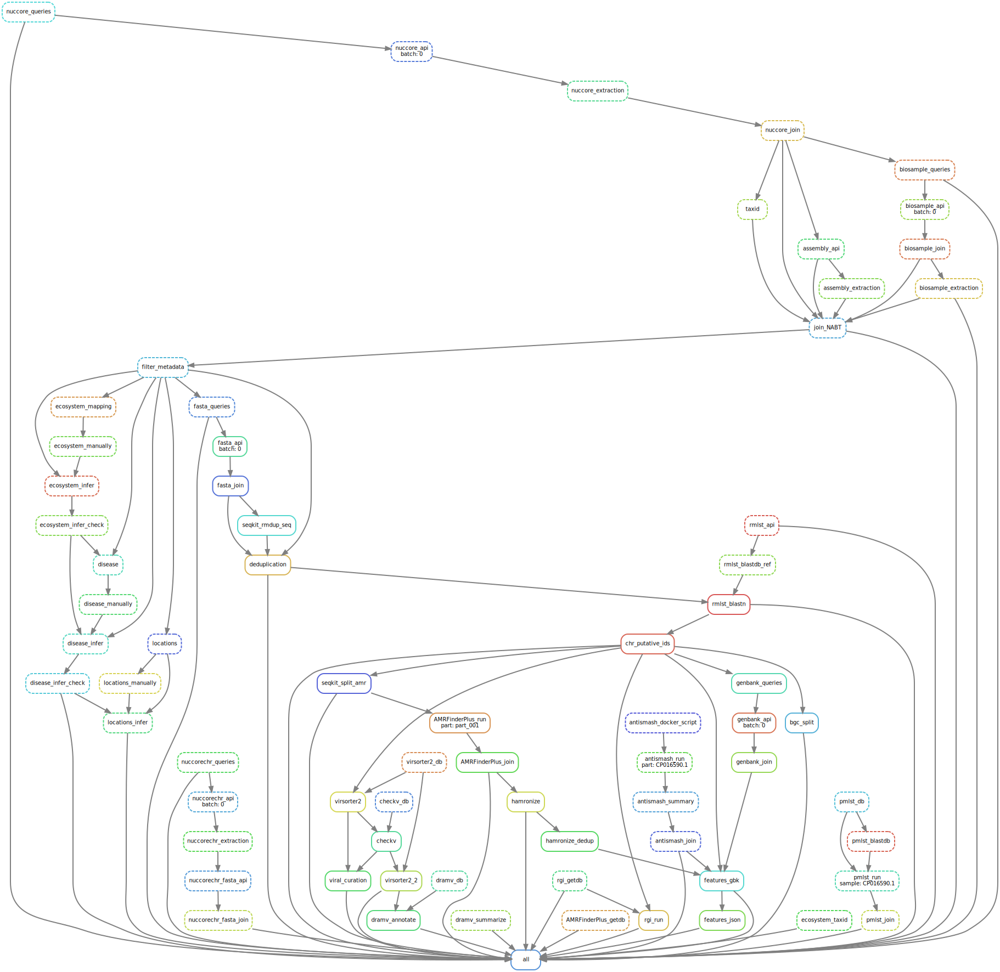

# PLSDB Pipeline

This is the repository of the snakemake pipeline used to generate PLSDB database. For further information, please visit our [webpage](https://ccb-microbe.cs.uni-saarland.de/plsdb2025/faq).
  
